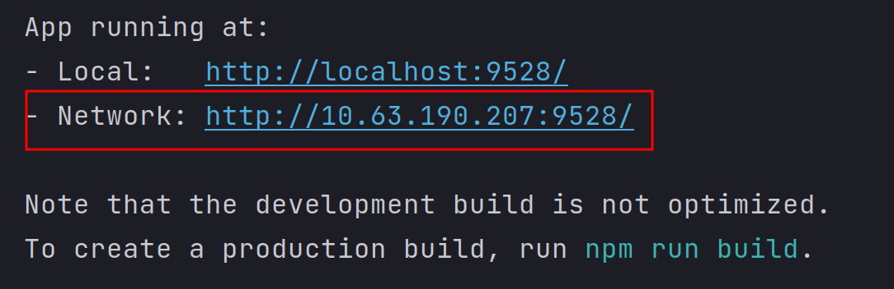

## 下载到本地

```bash
git clone https://github.com/dlrdaile/agv_project.git
```

## 配置后端环境

请看[后端配置文档](./agv_back_fastapi/README.md)

## 配置前端环境

## 登陆网页

请看[前端配置文档](./agv_front_vue/README.md)

1. 当网页和后端项目都启动后，网页请登陆下图所示url



2. 登陆界面如下：


管理员账号为：

username: admin

password: 123456

客户端账号可以自行注册