# 工厂销售管理与智能AGV小车调度控制系统

> 本仓库所存放的是该项目的前后端软件代码
>
> 该项目所有仓库链接如下：
>
> * [订单管理与agv任务调度检测软件前后端代码](https://github.com/dlrdaile/agv_project)
> * [STM32电机驱动与片上资源调度代码](https://github.com/dlrdaile/agv_stm32)
> * ROS自主导航系统的仿真与实体机代码
>
> <a id="video">**演示视频**</a>
>
> [基于仿真系统的演示视频](https://www.bilibili.com/video/BV1jr4y1776G/?spm_id_from=333.999.0.0)：该视频是疫情提前回家剪的，所以页面功能相对不完整
>
> 基于实体机器人的演示：(正在剪辑)

[TOC]

## 项目介绍

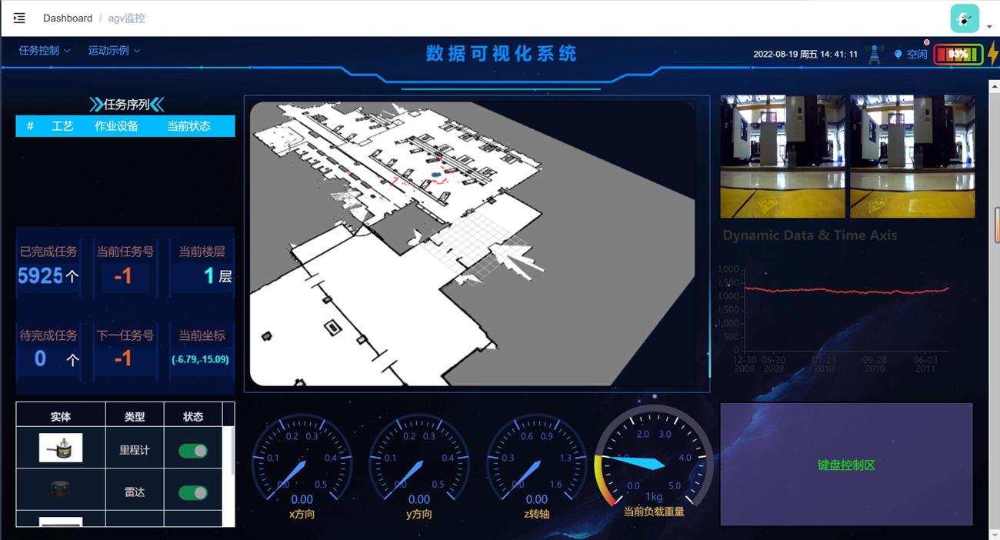

### 项目来源

本项目来源于北京理工大学智能制造工程(新工科专业)的新型培养模式下的**项目制课程**。该课程基于实际工厂的移动作业，弹性生产与智能调度需求，要求学生以产品化思维进行面向需求的**全产品生命周期设计与开发**。

### 项目特点

#### 工程化实践

当需求下发过后，作品的**场景定义、技术选型、物资采购与管理(BOM表等)，项目规划与推进(甘特图等)，工程架构与实现**等实际工程或产品开发所涉及的环节学生皆亲身经历并定期答辩和交付

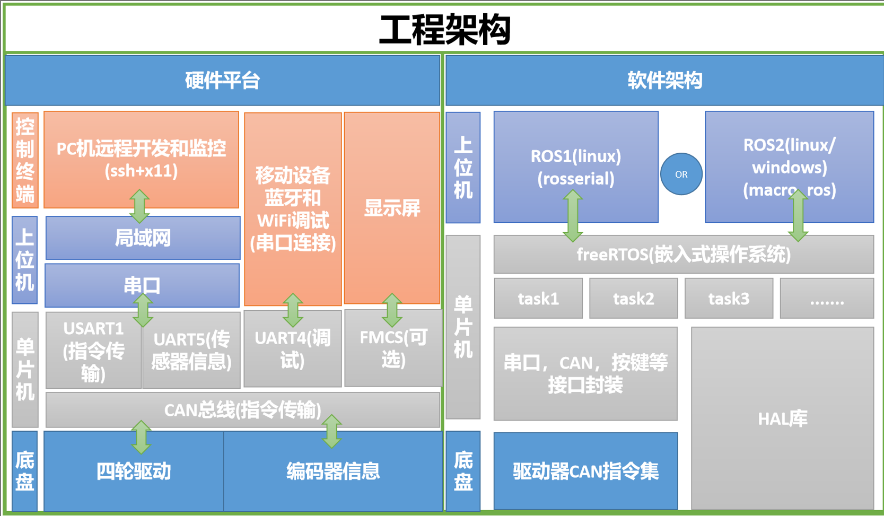

#### **多功能模块**

该项目需求场景较为宏大，我们定义并实现的核心模块包括：

1. 基于`FreeRTOS`的STM32单片机开发与CAN总线电机驱动
2. 基于Linux系统的ROS自主导航系统与资源调度算法开发
3. 基于`FastAPI`与`Vue2`的`RESTful`前后端分离网页开发
4. 基于`sqlite`的数据中心搭建与状态机管理
5. 基于`Opencv`的工件表面缺陷检测与深度检测

#### **多学科交叉**

本项目综合性较强：

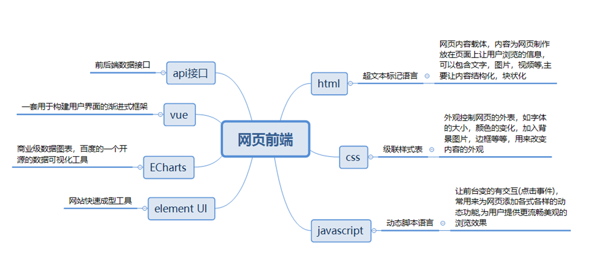

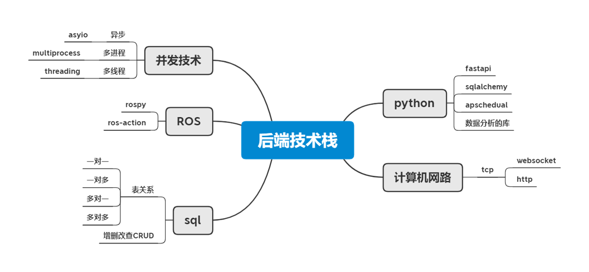

1. 基于**制造背景的知识**进行场景和功能模块的定义
1. 基于**电路知识与计算机组成原理**的单片机开发
1. 基于**操作系统知识**的多线程并发管理与实时操作系统FreeRTOS开发
1. 基于**计算机网络知识**的远程开发，多模块通讯(websocket、http、串口、iic等)
1. 基于**数据库知识**的关系型数据库与非关系型数据搭建及相关CRUD接口开发
1. 基于**机器视觉与信号与系统**相关技术的摄像头标定及算法开发
1. 基于**管理知识**的人员分工，成本控制，项目开发周期管理

1. **工程化项目组织意识**：

   1. 每个项目进行有意识的分文件管理，保证代码组织的有序，易于错误的排查
   2. 有效的项目结构划分使得我们可以很好的进行多人协作开发

   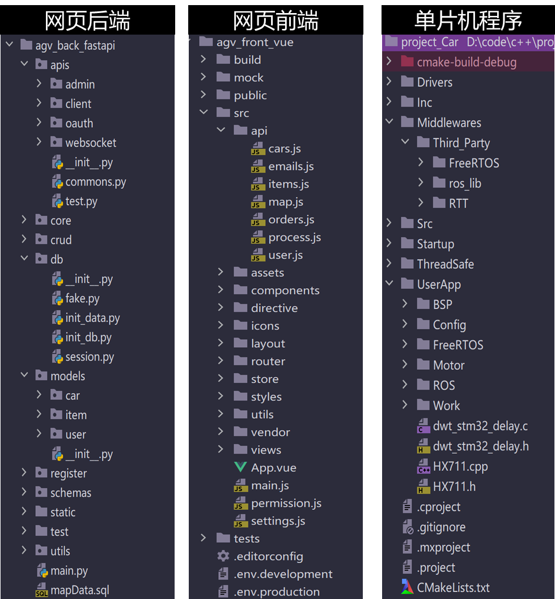

## 项目成果展示

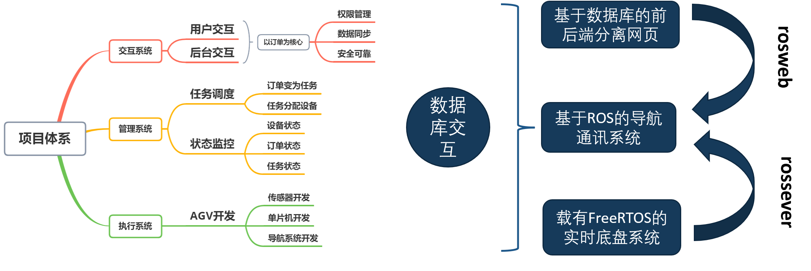

### 硬件与模型

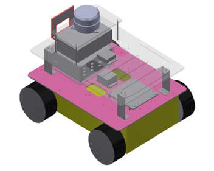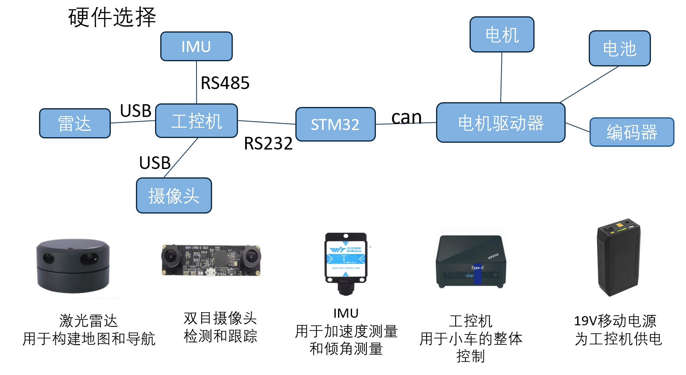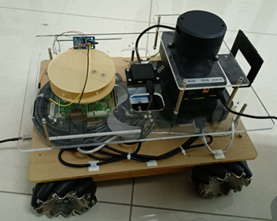

### 单片机驱动

> 本项目基于STM32F407VETX

#### 多重安全性机制：

1. 基于看门狗的**异常复位**(基于FreeRTOS的事件组机制)
2. 基于定时器的上位机指令查询，当超过一定时间没有接受到运动指令(时间可在上位机动态调整，默认8s)车子**自动停车**
3. 基于ROS LOG机制的下位机运行日志记录(包括warning、fatal、error等)
4. 基于FreeRTOS的线程抢占优先级机制，设置了高优先级指令处理线程，使得突发状况可以及时处理

#### 弹性配置：

1. 基于ROS sever服务器机制可在上位机对下位机连接的传感器(编码器、电池等)工作状态进行配置，包括传感器的工作使能控制和采样周期控制(基于软件定时器),经测试编码器查询速度最快可到8ms一次
1. 基于ROS param机制的初始参数配置，可在上位机编写yaml文件进行配置的保存

#### 模块化开发：

1. 基于C++面向对象的思想对不同的外设进行了封装，提高了同类外设驱动的复用性
2. 基于多线程的程序开发模式，可以通过创建新的线程快速集成新的外设模块

#### 高实时性：

1. 采用嵌入式实时操作系统保证**系统响应调度实时性**
2. 采用CAN总线和基于DMA的串口通讯保证**信息传输的实时性**

### ROS自主导航系统搭建

> 该模块具体效果可以参见[演示视频](#video)

#### 运动模型构建

> 对麦克纳姆进行正逆运动学转换，用以将编码器信息转化为欧式坐标系下的运动信息，从而构建小车的里程计信息

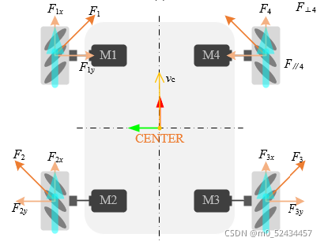         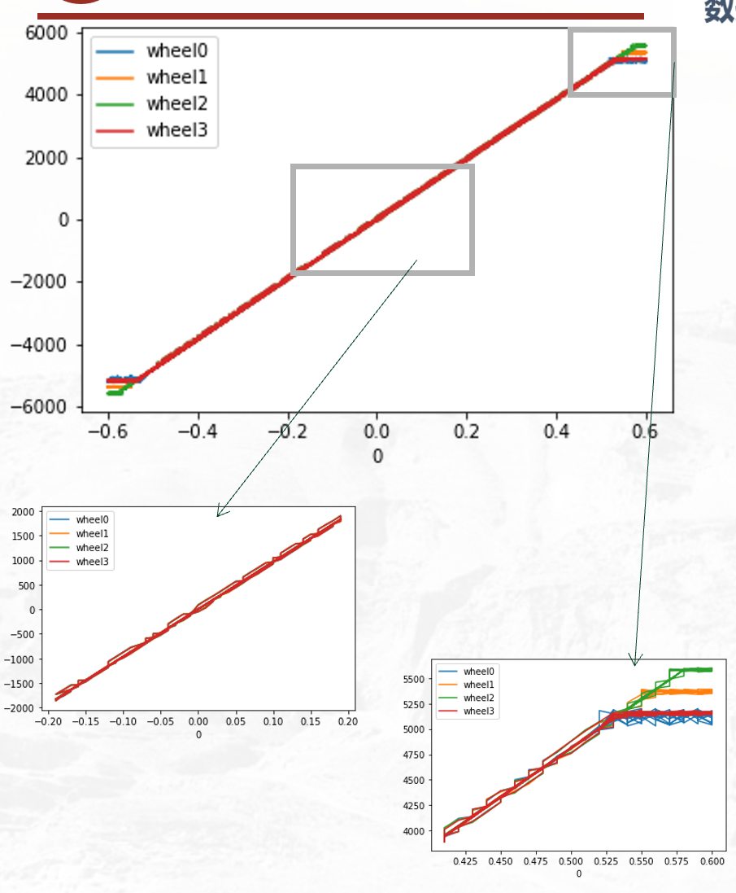    

**问题**：麦轮的运动学分析首先需要计算出由编码器测量所得的轮子运动线速度，由于麦轮**易于磨损**且基于尺度工具的测量必然存在**测量误差**，所以基于物理模型的编码器——轮速转换无法满足精度要求，故我们采取基于**统计回归模型的动态解算**

**解决方案**：

1. **数据采集**：首先在下位机有PID调控的情况下，采集不同速度设置下的编码器数据

> 此处假设在空载悬浮条件下，PID控制下的速度为精确值，经过激光测速仪测量校准，该假设近似成立

2. **异常值处理**：在采集过程中发现编码会由于数值溢出会产生显著的离群值，故此处我们使用**Z-score**和**DBSCAN**算法进行异常检测，对于异常值我们进行ROS日志警告，并将其进行舍弃

> 由于编码器采集速度很快，小车的速度不会发生突变，所以舍弃一两个异常值并不会影响里程计的计算

3. **统计回归**：基于先前所采集的数据进行回归预测，由此计算出每个轮子的实际速度

#### 导航系统构建

> 基于ROS的导航栈构建的导航系统

|   功能模块   |     算法选择      |                         备注                         |
| :----------: | :---------------: | :--------------------------------------------------: |
|   地图构建   |     gmapping      |                                                      |
|   位置估计   | ekf扩展卡尔曼滤波 | 融合imu和odom数据，在odom节点中实现了ekf动态激活功能 |
|   导航定位   |       amcl        |                                                      |
| 全局路径规划 |   Dijkstra算法    |                                                      |
| 局部路径规划 |      DWA算法      |                    避障和运动输出                    |

基于ROS的`dynamic parameter`进行大量调参后，实现：

1. 较好的路径规划和运动输出
   1. 运动不卡顿，转弯不困难，转向很随意
2. **极好的避障效果**
   1. 只要没人故意撞他，基本不会撞人
3. 长走廊位置不丢失
   1. 得益于较好的里程计
4. **定位鲁棒性强**
   1. 不会因为一群人围着而丢失位置

#### 导航功能扩展

* 多点导航的实现
  * 可以基于rviz进行多点导航的可视化设置
  * 可以基于节点的多点导航设置
* 多点导航状态的检测缓存
  * 可以在暂停当前任务后执行继续导航(任务恢复)和任务取消功能

### 机械视觉

#### 工件表面质量检测

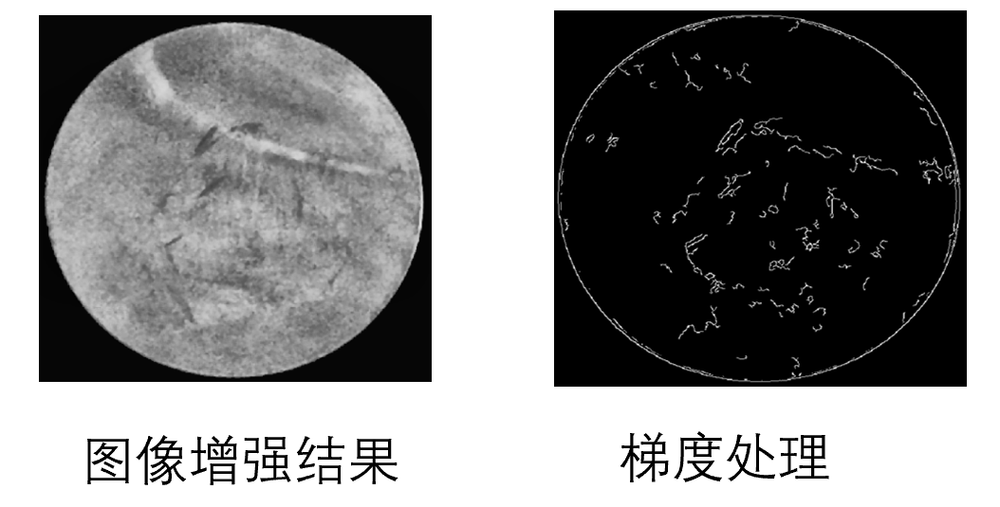

#### 深度检测

> 由于小车的雷达为2D雷达，故无法对于矮于雷达的障碍或透明障碍进行检测，故需要借助于视觉进行深度检测，从而实现3D避障

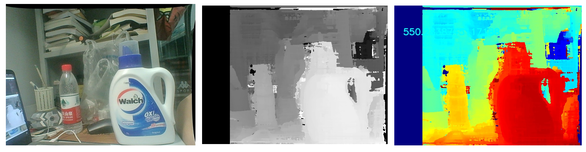

此图可见对于塑料瓶等透明物体也能较好的进行识别

## 工厂销售管理于agv调度软件

### 后端

#### 前后端分离

基于fastapi框架可以很方便的进行接口的测试与验证

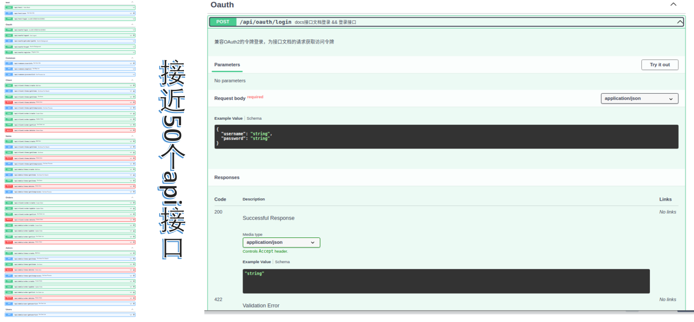

#### 数据库搭建

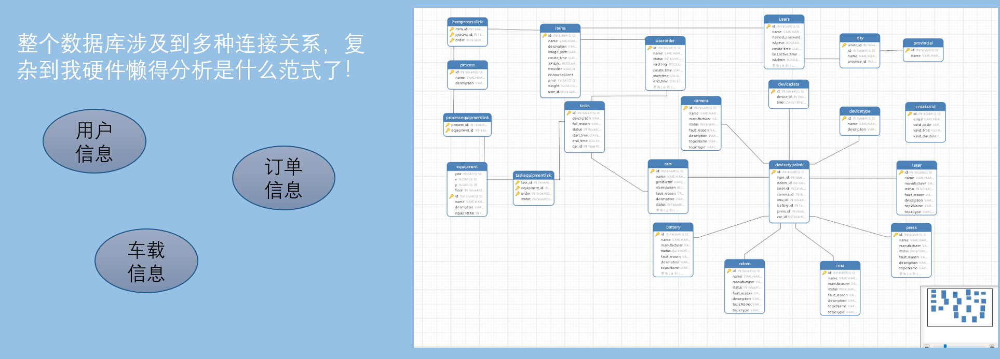

#### 订单调度执行与状态管理

基于数据库实现了多对象的状态机管理，在本项目中我们定义的软件调度如下：

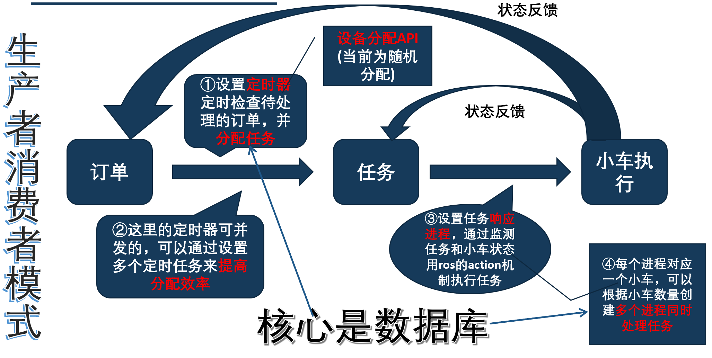

其中，订单，任务，小车，客户皆有自己的状态：

|  | 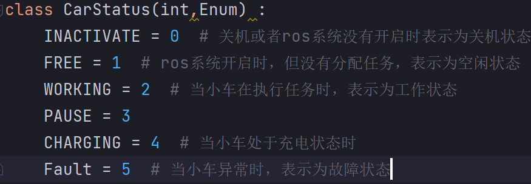 | 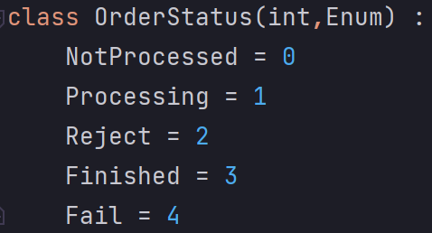 |
| ------------------------------------------------------------ | ------------------------------------------------------------ | ------------------------------------------------------------ |

### 前端

#### 多用户路由

> 通过vue-route实现同一登录界面，基于账号不同的客户端与管理者的界面分离

| 登录界面                                                     | 客户端                                                       | 管理端                                                       |
| ------------------------------------------------------------ | ------------------------------------------------------------ | ------------------------------------------------------------ |
| 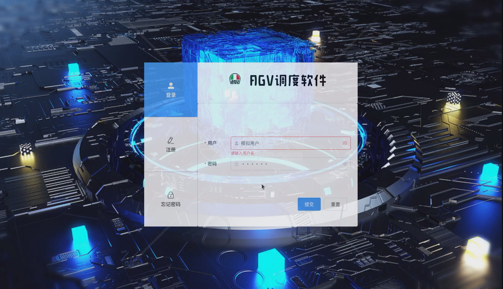 | 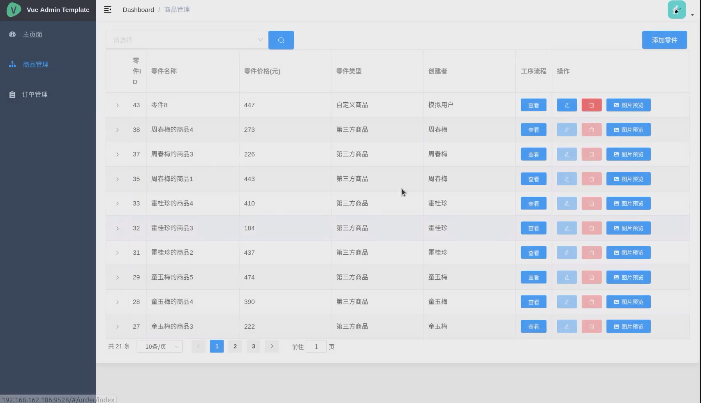 | 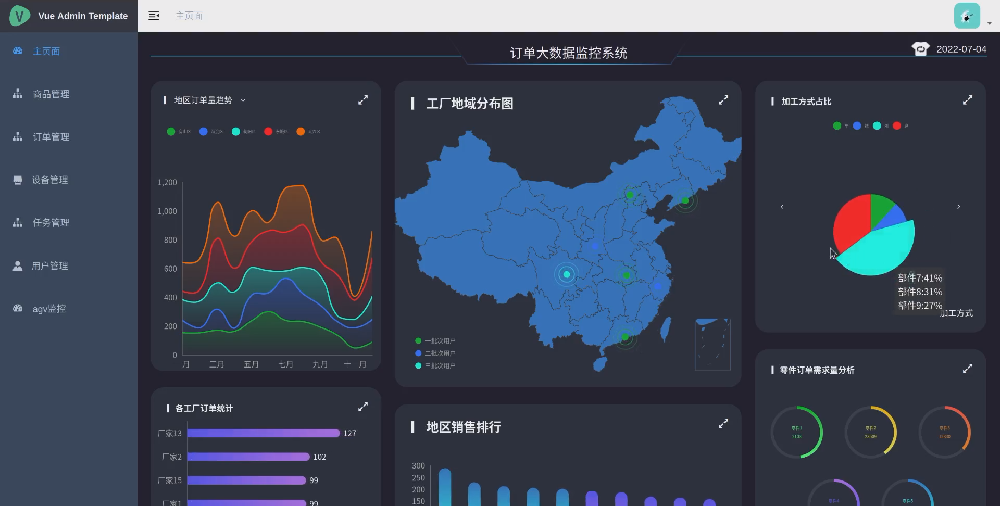 |

#### 伪数字孪生的agv实时监控与控制

> 基于echarts和websocket实现实时大屏可视化推送

* 该页面通过websocket与后端进行实时通讯，页面包含以下功能：
  1. 移动小车实时工作三维可视化
  2. 全向键盘控制和差速键盘控制(可调速)
  3. 可配置图像显示，主要用来显示相机视图和相机处理后的视图
  4. 订单调度列表
  5. 车辆工作信息
  6. 设备工作状态
  7. 速度监测和负载监测
  8. 电量、网络、小车状态显示
  9. 配置与任务状态控制
  10. 可配置的ros话题可视化

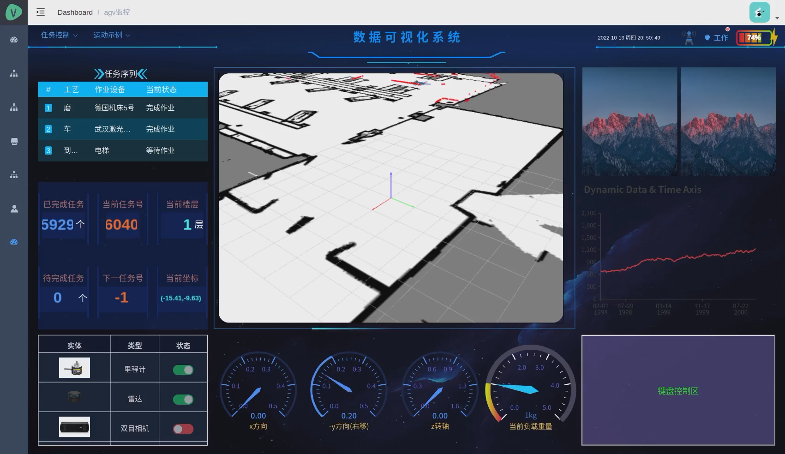

#### 其他页面

##### 商品页面

* 该页面将商品分为：

  * 客户定义商品
  * 第三方定义商品
  * 官方定义商品

  > 这样可以实现不同用户间商品定义共享，扩大开源精神

* 每个商品可以定义其加工工序，这些工序定义可用于后续订单调度坐标提取

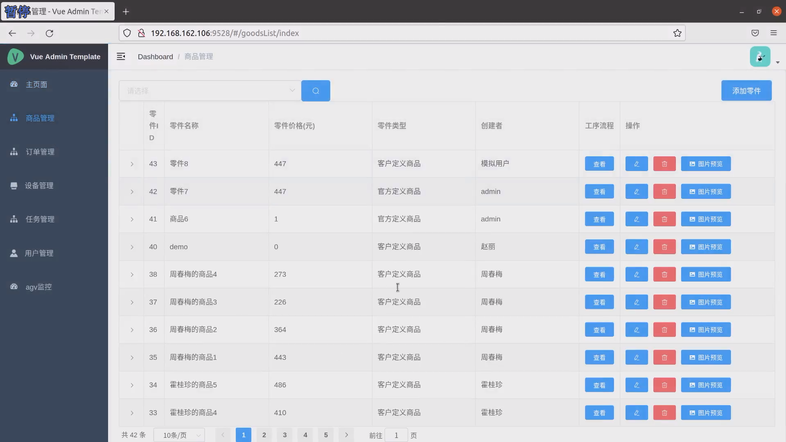

##### 订单页面

* 在该页面，客户可以基于商品定义订单，只要订单尚未被官方处理，客户都可以修改订单，直到客户提交了订单，后台才能看到用户的订单信息
* 客户和后台都能看到订单当前的状态，如果订单处理失败，可以看到失败的原因

|                            客户端                            |                            管理端                            |
| :----------------------------------------------------------: | :----------------------------------------------------------: |
| 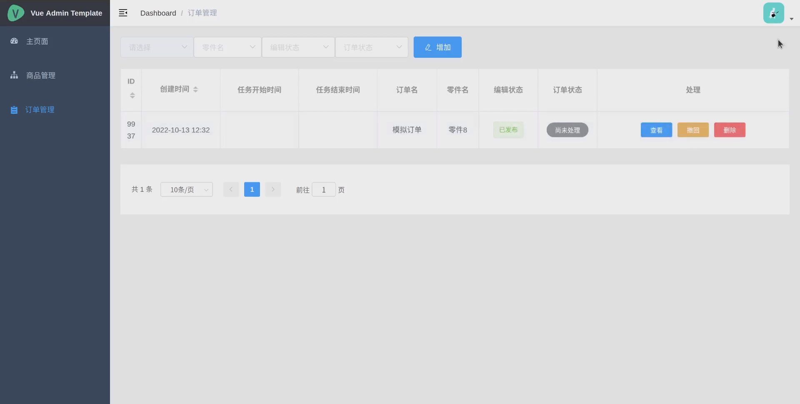 | 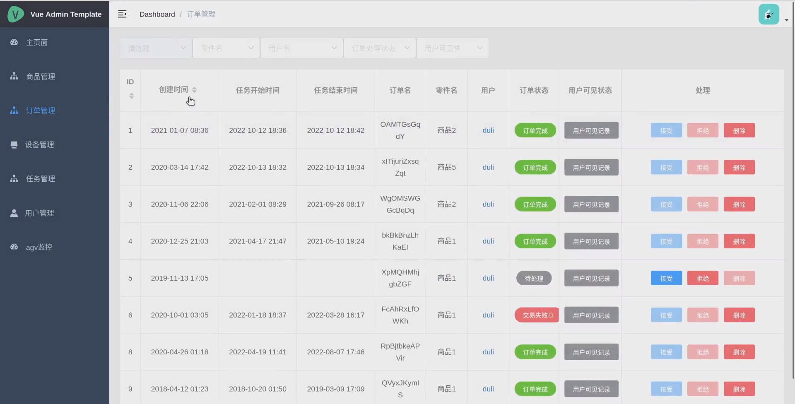 |

##### 设备管理页面

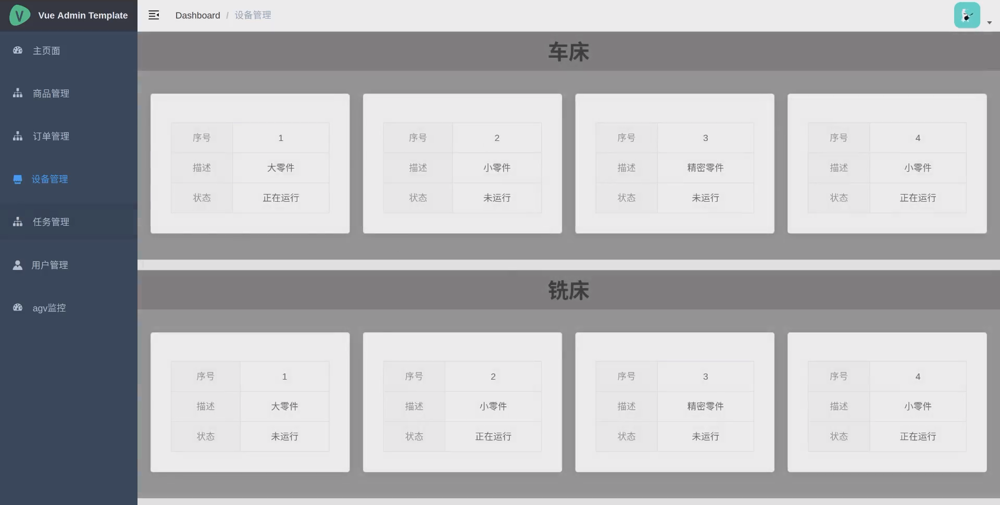

