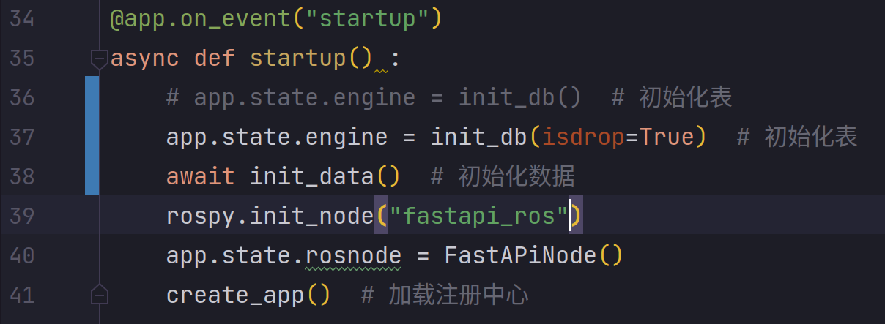
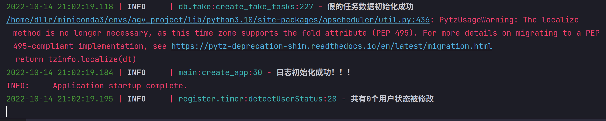

# agv_back_fastapi

> 这是agv调度软件的后端部分

## 环境配置

> 项目基于`fastapi`和`sqlmodel`构建

```bash
# 克隆项目
# git clone https://github.com/dlrdaile/agv_project.git
# 确保已经clone或下载项目到本地
# 进入项目目录
cd agv_project/agv_back_fastapi/

# 创建python虚拟环境，python>=3.10
conda create --name env_name python=3.10 -y

#下载项目依赖的第三方库
pip install -r requirements.txt
```

## 生成数据库和虚拟数据

> 如果电脑上没有相关ros环境，请切换到`login_with_no_ros`分支

1. 打开`main.py`文件，找到`async def startup() :`这一行代码
2. 将该函数体中第一行代码注释，第二第三行打开并运行程序



3. 运行程序

```bash
# 激活虚拟环境
conda activate env_name
#运行程序
python main.py
```

当显示如下画面



将刚刚打开的两行代码注释，并打开第一行代码，重新运行程序

----

**返回[`Install.md`](../Install.md)**
